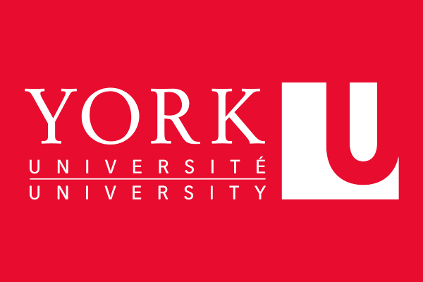

#With these meetings, we hope to refine and unite.

###Reading is observation
"Observation" is the first step of the scientific method we all learn in middle school. But what we didn't know is that as a research scientist, that step is takes the form of reading peer-reviewed articles. Graduate students, early career scientists, and seasoned experts all can benefit from crowd-sourced ideas and perspectives, and a journal club is a great mechanism for this sort of practice and sharing.

###Interdisciplinary inspiration, focused foundation
Journals clubs that focus on the participates' area of study are overall more benefitial to those attending the club (cite). But the more refined you become, the more likely you are to not see beyond your own laptop screen. This is why we've designed a dyad of a club; Two meetings, two sections, one goal: interdisciplinary inspiration. This is why we've split our meetings into the ecology/evolution group and the molecular/physiological group. Each group discusses a paper relevant to their subdiscipline but we come together at the end of each meeting to highlight our respective highlights. Inspiration can come from anywhere, after all!

###Student led, expert supported
Designed by student for students, these meetings are a space where budding scientists are free to express their thoughts on a subject without grades, standards, or pressure. We hope to give ourselves the freedom to brainstorm and make mistakes to the end of better understanding the material. A student will give a short talk to present the chosen paper, and lead a critical discussion. However, this is also open to falculty members and guests! We especially hope to have guests come and present short talks as often as possible, giving us the opportunity to be fresh and to learn. 

#Dates and Times
These meetings will be held twice a month, with flexible dates. We'll try to keep our times based on how many people can attend, and there will be FREE FOOD! So what's not to like? 

###September 26
**Eco/Evo**: Malory Owen & Dr. Ray Callaway

**Micro/Physio**: TBD

###October 3 
**Eco/Evo**: Student TBD & Dr. Jacob Lucero

**Micro/Physio**: TBD

